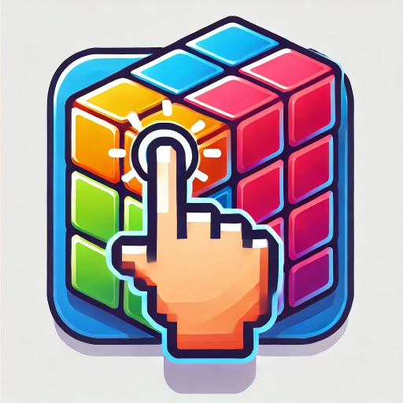

<!DOCTYPE html>
<html lang="zh">
<head>
    <meta charset="UTF-8">
    <meta name="viewport" content="width=device-width, initial-scale=1.0">
    <meta name="description" content="开发者个人网站，展示我的游戏作品">
    <title>我的游戏开发者网站</title>
    <link rel="stylesheet" href="styles/style.css">
</head>
<body>
    <header>
        <h1>欢迎来到我的游戏开发者网站</h1>
    </header>

    <section class="game-info">
        <h2>游戏名称：DotDotClear</h2>
        
        
DotDotClear 是一款有趣的休闲游戏，你需要点击并破坏方块组合，利用重力消除行。简单易学，挑战性十足！

    </section>

    <section class="contact">
        <h3>联系方式</h3>
        <ul>
            <li>邮箱: jeancber90@gmail.com</li>
        </ul>
    </section>

    <footer>
        
&copy; 2025 yourusername. 版权所有。

    </footer>
</body>
</html>
